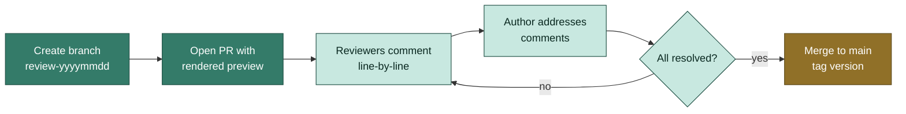

# Phase 3 — Review

Internal review with collaborators using PR-based git workflow.

## The review cycle



## Open a review branch + PR

```bash
git checkout -b review-2026-05-15
git push -u origin review-2026-05-15
gh pr create --draft --title "Review: methods + intro draft" \
  --body "Ready for review by @collaborator-1, @collaborator-2"
```

The `--draft` flag marks the PR as not-ready-to-merge — reviewers see comments
go in but no auto-merge.

## Attach a rendered preview

For PDF reviewers, attach the latest render:

```bash
just manuscript-render
gh pr comment <PR#> --body "Latest PDF: $(curl --silent --upload-file \
  writeup/manuscript/_manuscript/manuscript.pdf https://transfer.sh/manuscript.pdf)"
```

For HTML reviewers (most modern teams), set up GitHub Pages on the branch:

```yaml
# .github/workflows/pr-preview.yml
on:
  pull_request:
    paths: ['writeup/manuscript/**']

jobs:
  preview:
    runs-on: ubuntu-latest
    steps:
      - uses: actions/checkout@v4
      - uses: quarto-dev/quarto-actions/setup@v2
      - run: just manuscript-render
      - uses: rossjrw/pr-preview-action@v1
        with:
          source-dir: writeup/manuscript/_manuscript
```

Each PR gets a `https://abhi18av.github.io/my-paper/pr-preview/<branch>/` URL.

## Reviewer comments — three patterns

### Pattern 1: Inline GitHub PR comments

The most common. Reviewer clicks a line in the diff and adds a comment.
Author resolves with a commit + "Resolve conversation" click.

### Pattern 2: Tracked changes via `markmap` / `critic-markup`

For prose-heavy review:

```markdown
The data was {++cleaned++} {--processed--} using `pandas`.
```

`{++added++}` and `{--removed--}` render to inline diffs. Convert to plain
text after merge.

### Pattern 3: Word doc round-trip

Some collaborators only review in Word. Render to docx, send, get tracked-
changes back, manually merge:

```bash
just manuscript-render
# email writeup/manuscript/_manuscript/manuscript.docx
# get back manuscript_reviewed.docx
diff <(pandoc -t markdown manuscript.docx) \
     <(pandoc -t markdown manuscript_reviewed.docx)
# manually port changes
```

## Common review checklist

Add `.github/PULL_REQUEST_TEMPLATE/manuscript-review.md`:

```markdown
## Manuscript review checklist

- [ ] **Abstract** — single paragraph, ~250 words, claims match results
- [ ] **Introduction** — gap clearly stated, contributions enumerated
- [ ] **Methods** — reproducible from text alone (data + code + parameters)
- [ ] **Results** — figures captioned, statistical tests labeled
- [ ] **Discussion** — limitations explicit, future work concrete
- [ ] **Citations** — all `@key` references resolve in `.bib`
- [ ] **Figures** — vector format where possible, ≤300 dpi raster
- [ ] **Tables** — captions describe units, n, and significance markers
- [ ] **Cross-references** — `@fig-x` / `@tbl-y` / `@eq-z` all resolve
- [ ] **Spelling** — `aspell -c manuscript.qmd` clean
- [ ] **Word count** — within journal limit
```

Set as the default PR template by linking it in `.github/pull_request_template.md`:

```markdown
See [manuscript-review.md](./PULL_REQUEST_TEMPLATE/manuscript-review.md)
```

## Resolving comments

Convention:

1. Make the change in a new commit on the review branch
2. Reference the resolution in the comment thread:
   ```
   Addressed in d4e5f6a — reworded the methods paragraph and split the
   figure into 1a/1b.
   ```
3. Click "Resolve conversation"
4. Re-request review

Avoid rebasing the review branch — commits are review-anchored. Squash on
merge if you want a clean history on `main`.

## Merge and tag

```bash
gh pr ready <PR#>             # mark draft → ready
gh pr merge <PR#> --squash    # squash and merge
git checkout main && git pull
git tag -a v0.5-internal-review -m "Internal review round 1 complete"
git push --tags
```

[Next: Versioning →](./versioning)
