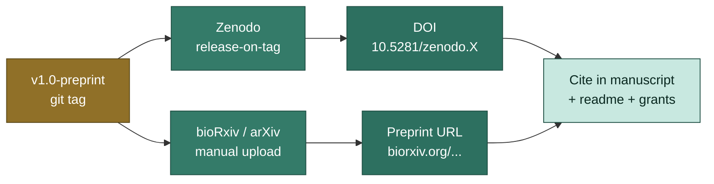

# Phase 5 — Preprint

Publish the v1.0 manuscript before formal journal review. Two complementary
artifacts: a Zenodo DOI for permanent citation, and a discipline-specific
preprint server (bioRxiv / arXiv / SSRN).

## Preprint flow



## Pre-flight checklist

Before tagging `v1.0-preprint`:

- [ ] All figures pull from a single `data/publications/v<x>/` directory
  (check: `grep -r "data/08_reporting" writeup/manuscript/` should be empty)
- [ ] Every `@cite-key` resolves in `references.bib`
- [ ] Author list, affiliations, and ORCIDs complete
- [ ] Abstract within target word count (typically 150-300)
- [ ] All `<!-- TODO: ... -->` HTML comments resolved
- [ ] Spell-check pass (`aspell -c writeup/manuscript/manuscript.qmd`)
- [ ] PDF renders without errors (`just manuscript-render`)
- [ ] `data/publications/v1.0/` exists and renders standalone
  (`quarto render data/publications/v1.0/<topic>-report.qmd`)

## Tag the version

```bash
git checkout main
git pull
git tag -a v1.0-preprint -m "Preprint snapshot

Versioned reports: data/publications/v1.0/
Zenodo DOI: (pending — set after upload)
bioRxiv: (pending — set after upload)"
git push --tags
```

## Zenodo DOI (release-on-tag)

[Zenodo](https://zenodo.org/) gives every git tag a citable DOI.

### One-time setup

1. Sign in to Zenodo with GitHub OAuth
2. Visit https://zenodo.org/account/settings/github/ and toggle ON your repo
3. Future git tags push automatically to Zenodo as new releases

### Verify

After pushing `v1.0-preprint`, Zenodo will:
1. Pull the GitHub release (auto-created by the CI workflow from
   [Versioning](./versioning))
2. Mint a DOI in the form `10.5281/zenodo.<number>`
3. Email you the DOI

### Update the tag with the DOI

```bash
git tag -d v1.0-preprint                # delete old tag
git tag -a v1.0-preprint -m "Preprint snapshot

Versioned reports: data/publications/v1.0/
Zenodo DOI: 10.5281/zenodo.1234567
bioRxiv: (pending)"
git push --tags --force                 # one-time force, then never again
```

(Alternatively: just amend `writeup/manuscript/VERSIONS.md` and tag a v1.0.1.)

### Cite the DOI in the manuscript

In the front matter or "Data and code availability":

```markdown
The full source code and versioned reports for this manuscript are
archived at Zenodo, DOI 10.5281/zenodo.1234567.
```

## bioRxiv / arXiv submission

Different platforms; same general flow.

### bioRxiv (life sciences)

1. Render the PDF: `just manuscript-render`
2. Bundle supplementary materials (figures, code, data summaries):
   ```bash
   tar -czf supplementary.tar.gz \
       data/publications/v1.0/ \
       writeup/manuscript/manuscript.pdf \
       README.md
   ```
3. Upload at https://www.biorxiv.org/submit-a-manuscript:
   - Manuscript: `writeup/manuscript/_manuscript/manuscript.pdf`
   - Supplementary: `supplementary.tar.gz`
   - Authors: copy from `_quarto.yml` author list
   - License: CC-BY-4.0 (recommended for open science)
4. After acceptance, bioRxiv emails the DOI (e.g. `10.1101/2026.06.15.123456`)

### arXiv (math, CS, physics, quant bio)

1. arXiv requires LaTeX source, not just PDF
2. Render LaTeX: `quarto render --to latex` produces `manuscript.tex`
3. Bundle the working tree:
   ```bash
   cd writeup/manuscript/_manuscript/
   tar -czf submission.tar.gz manuscript.tex *.bbl figures/
   ```
4. Upload at https://arxiv.org/submit
5. Pick a category (e.g. `cs.LG`, `q-bio.QM`)
6. arXiv assigns an ID like `2026.05.12345`

### SSRN (social sciences) / OSF Preprints

Similar pattern: PDF + supplementary, upload via web portal.

## Update the manuscript with the preprint DOI

After bioRxiv/arXiv ID arrives:

```markdown
---
title: "..."
preprint:
  biorxiv: 10.1101/2026.06.15.123456
  url: https://www.biorxiv.org/content/10.1101/2026.06.15.123456v1
---
```

Some journals require you cite your own preprint in the submission (or
exclude it). Check the journal's preprint policy.

## Linking versioned reports to the preprint

The Zenodo release contains:
- Source code
- `writeup/manuscript/manuscript.pdf`
- `data/publications/v1.0/` (binary outputs are tracked via `dvc.yaml`)

For full reproducibility, also push DVC-tracked data to a public remote:

```bash
dvc remote add -d zenodo s3://zenodo-bucket/penguins-paper/
dvc push
```

Cite in the data availability statement:

```markdown
# Data and code availability

Source code and rendered figures are archived at Zenodo
(DOI 10.5281/zenodo.1234567). DVC-tracked data is available at
s3://zenodo-bucket/penguins-paper/. To reproduce the v1.0 figures locally:

    git clone https://github.com/your-org/penguins-paper
    cd penguins-paper
    git checkout v1.0-preprint
    dvc pull
    quarto render data/publications/v1.0/classifier-report.qmd
```

## Announcing the preprint

Add a release blurb (`tasks/announce.just` could automate this):

- Twitter/X / Mastodon: title + bioRxiv link + 1-figure summary
- Lab Slack: PDF + bioRxiv URL + thread for internal Q&A
- arXiv announcements list (auto)
- Personal website / Quarto blog (`just grow writeup:blog`)

[Next: Journal submission →](./journal)
