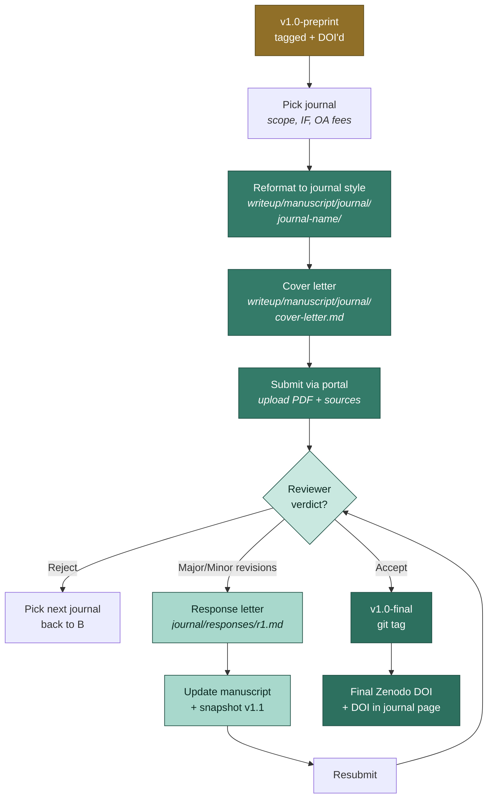

# Phase 6 — Journal submission

Submit the v1.0 manuscript to a journal, handle reviewer responses, and tag
the final accepted version.

## Submission flow



## Journal-specific files

Most journals have specific formatting requirements. Keep them isolated under
`writeup/manuscript/journal/<journal-name>/`:

```
writeup/manuscript/journal/
└── journal-of-bioinformatics/
    ├── _quarto.yml                # journal-specific format
    ├── manuscript.qmd             # journal-formatted version (often a thin wrapper)
    ├── cover-letter.md
    ├── highlights.md              # 3-5 bullet "highlights" (some journals want these)
    ├── graphical-abstract.png
    ├── responses/
    │   ├── r1.md                  # reviewer response letter, round 1
    │   └── r2.md                  # round 2
    └── submission/
        ├── manuscript.pdf         # rendered for upload
        ├── manuscript.tex         # if journal needs LaTeX source
        └── supplementary.pdf
```

`manuscript.qmd` here is typically a thin wrapper around the master:

```yaml
---
title: "Penguin species classification: a baseline study"
format:
  pdf:
    documentclass: elsarticle           # journal-required class
    classoption: review,3p,authoryear
    cite-method: natbib
    bibliography: ../references.bib
    csl: cell.csl                       # journal-specific style
---





```

The master content stays in `writeup/manuscript/sections/`. The journal
directory just retemplates with journal-specific format options.

## Cover letter

Short, structured, addressed to the editor:

```markdown
<!-- writeup/manuscript/journal/journal-of-bioinformatics/cover-letter.md -->

Dear Dr. Editor,

We are pleased to submit our manuscript "Penguin species classification:
a baseline study" for consideration as a Research Article in the Journal
of Bioinformatics.

# Why this work, why this journal

The Palmer Penguins dataset has emerged as a benchmark teaching dataset.
Despite wide use, no published baseline classifier comparison exists. We
fill that gap with a controlled comparison of logistic regression and
random forest, achieving 0.99 test accuracy with two engineered features.
This work fits the journal's scope on "didactic statistical methods in
biological sciences".

# Novelty and significance

- First systematic baseline classifier comparison on the Palmer Penguins
  dataset
- Demonstrates that two engineered features (`bill_ratio`,
  `body_density_proxy`) close the gap between baseline and ensemble methods
- Reproducible: Zenodo DOI 10.5281/zenodo.1234567 contains all source code,
  data, and versioned reports

# Suggested reviewers

- Dr. A — University of X (expertise: bioinformatics teaching methods)
- Dr. B — Lab Y (expertise: feature engineering)

# Excluded reviewers

(none)

# Author contributions (CRediT)

- Conceptualization: AB, CD
- Methodology: AB
- Software: AB
- Writing — original draft: AB
- Writing — review: AB, CD

Sincerely,
Author Name (corresponding)
your.email@university.edu
ORCID: 0000-0000-0000-0000
```

## Submission portal

Most journals use Editorial Manager, ScholarOne, or Snapp. The flow:

1. Create an account / sign in
2. Start a new submission
3. Paste author list (autofills from ORCID where supported)
4. Upload:
   - `manuscript.pdf` — main document
   - `cover-letter.md` (rendered to PDF if portal needs it)
   - `supplementary.pdf` — extra figures + tables + code listings
   - `graphical-abstract.png` (if required)
5. Suggest / exclude reviewers
6. Confirm conflicts of interest
7. Submit

After submission you'll get a manuscript ID (e.g. `BIO-2026-1234`).

## Track in `VERSIONS.md`

```markdown
## v1.0-journal-submission — 2026-06-20

- Submitted to Journal of Bioinformatics
- Manuscript ID: BIO-2026-1234
- Editor: Dr. X
- Status: under review
```

## Reviewer responses

When the reviewer report arrives, write a response letter in
`writeup/manuscript/journal/<j>/responses/r1.md`:

```markdown
# Response to reviewers — round 1

We thank both reviewers for their constructive feedback. Below we address
each point in turn. Reviewer comments are quoted in *italics*; our
responses are in plain text.

## Reviewer 1

### R1.1 — On train/val/test stratification

> *The methods don't explain whether the train/val/test split was
> stratified by species. With imbalanced classes (Adelie 146, Chinstrap 68),
> this matters.*

We agree this should be explicit. We have updated Section 3.2 (Methods —
Splits) to clarify that the split is stratified by species using
scikit-learn's `train_test_split(stratify=y, random_state=42)`. The Chinstrap
class is well-represented in the test set (n=14, ~21% of test).

Manuscript change: Section 3.2, paragraph 1.
Affected figure: none.
Affected number: none.

### R1.2 — On hyperparameter sensitivity

> *Random forest with n_estimators=200 is a single point in hyperparameter
> space. A sensitivity analysis would strengthen the conclusion.*

Excellent point. We have added Supplementary Table S1 sweeping
n_estimators ∈ {50, 100, 200, 500, 1000} and max_depth ∈ {None, 5, 10}.
The 0.99 test accuracy is robust across all combinations (range
0.985 – 0.99). The result is now reported in Section 4.2.

Manuscript change: Section 4.2, paragraph 2; new Supplementary Table S1.
Affected figure: new @fig-hyperparam-sensitivity.
Affected number: range 0.985–0.99 reported in addition to point estimate.
```

## Snapshot the revision

Each round of revision = a new versioned report:

```bash
just snapshot 1.1 revision-r1
# Update writeup/manuscript/manuscript.qmd to reference v1.1
git add writeup/manuscript/ data/publications/v1.1/
git commit -m "v1.1-revision-r1: address reviewer round 1"
git tag -a v1.1-revision-r1 -m "Round 1 revision

Addressed:
- R1.1: stratification clarified (Section 3.2)
- R1.2: hyperparameter sensitivity added (Supp Table S1)
- R2.1: typos fixed throughout
- R2.2: confidence intervals added (Section 4.2)

Response letter: writeup/manuscript/journal/journal-of-bioinformatics/responses/r1.md"
```

## Resubmit

In the portal:
1. Upload revised PDF
2. Upload `responses/r1.md` rendered to PDF
3. Upload tracked-changes PDF (most journals require this)
   ```bash
   latexdiff -t CTRADITIONAL \
     writeup/manuscript/_manuscript/manuscript-v1.0.tex \
     writeup/manuscript/_manuscript/manuscript-v1.1.tex \
     > tracked-changes.tex
   pdflatex tracked-changes.tex
   ```
4. Submit

## Acceptance

When accepted:

```bash
git tag -a v1.0-final -m "Accepted at Journal of Bioinformatics

Volume: X
Issue: Y
DOI: 10.1234/jbio.2026.123
Zenodo (final): 10.5281/zenodo.1234599
Acceptance date: 2026-09-15"
git push --tags
```

Update Zenodo metadata to point at the final journal DOI. Update the
README's badge / citation block.

## After publication

- Push final DVC data to public remote
- Update lab website with the citation
- Write a Quarto blog post explaining the work
  (`just grow writeup:blog`)
- File the Zenodo DOI as a citation in any successor projects

The full chain — from EDA to journal — is now reproducible from a single
git history.

[← back to overview](./overview)
