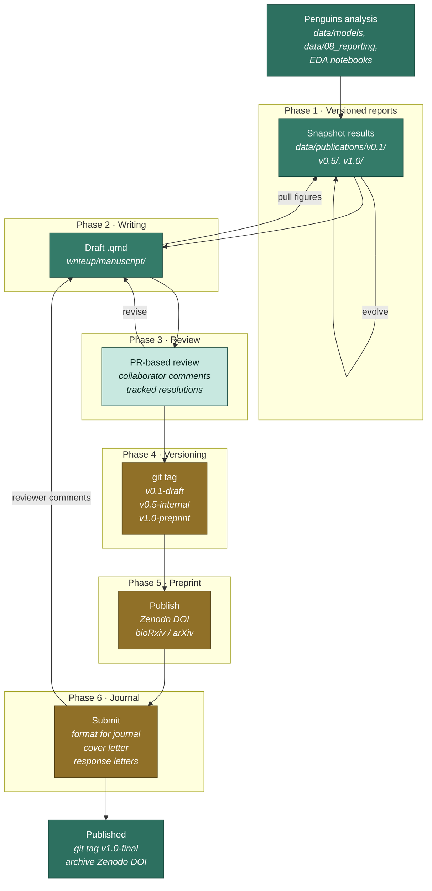

# Manuscript-only workflow

This section continues the [penguins study](/docs/penguins/overview): you've
trained a classifier, generated figures, and now want to **publish the work**.

The template automates **6 phases** between "results in hand" and "paper
published": versioned reports → writing → review → version tagging → preprint →
journal submission.

## The flow



## Phases at a glance

| # | Phase | What you do | Where it lives |
|---|---|---|---|
| **1** | [Versioned reports](./versioned-reports) | Snapshot Quarto reports at milestones (v0.1, v0.5, v1.0) | `data/publications/v*/` |
| **2** | [Writing](./writing) | Draft manuscript, pull figures from versioned reports | `writeup/manuscript/` |
| **3** | [Review](./review) | PR-based collaborator review with line-level comments | git PRs + `responses/` |
| **4** | [Versioning](./versioning) | Tag drafts, internal review, preprint, final | git tags + Zenodo |
| **5** | [Preprint](./preprint) | Publish to bioRxiv / arXiv / Zenodo before formal review | DOI-stamped artifact |
| **6** | [Journal submission](./journal) | Reformat, cover letter, response letters | `writeup/manuscript/journal/` |

## Two starting points

**Path A — You already did the penguins analysis (recommended for this walkthrough)**

You have:
- `data/models/062_candidate/rf.joblib`
- `data/08_reporting/082_figures/cm_rf.png`
- `data/08_reporting/082_figures/penguins_pairplot.png`
- `notebooks/02-exploration/eda/<ts>_eda_penguins-overview.qmd`

`writeup/manuscript/` is already in your active root (Full Academic plants it).
Skip to [Phase 1 — Versioned reports](./versioned-reports).

**Path B — Scaffold a fresh manuscript-only project**

Use this when you're co-authoring a review article, theory paper, or paper
based on someone else's data.

```bash
copier copy --trust gh:abc-cluster/abc-project-template my-paper
# Pick: project_type = "Manuscript Only (writing and publications)"
```

This auto-plants `writeup:presentation`, `writeup:abstracts`, `writeup:poster`,
`writeup:grants`, `writeup:book`. `writeup/manuscript/` is in active root.
The data stages stay dormant — plant `data:publications` later if you need a
landing dir for figures from elsewhere.

## Why versioned reports

A manuscript evolves over months. The data, models, and figures evolve in
parallel. Without discipline, you end up with:

- Figures in the manuscript that no longer match `data/08_reporting/`
- "Where did this number come from?" months after the fact
- Different reviewers seeing different numbers across rounds

Versioned reports solve this: **at every milestone, you snapshot the analysis
state into `data/publications/v<x>/`** as a self-contained Quarto report.
The manuscript then references a *specific version* of every figure and table.

Resulting properties:

- Reproduce v0.1's pairplot months later by checking out `git@v0.1-draft`
- Reviewer round-1 comments tied to v0.5 figures; round-2 to v0.7
- Final preprint is locked at v1.0 — no risk of post-submission drift

[Phase 1 — Versioned reports →](./versioned-reports)
